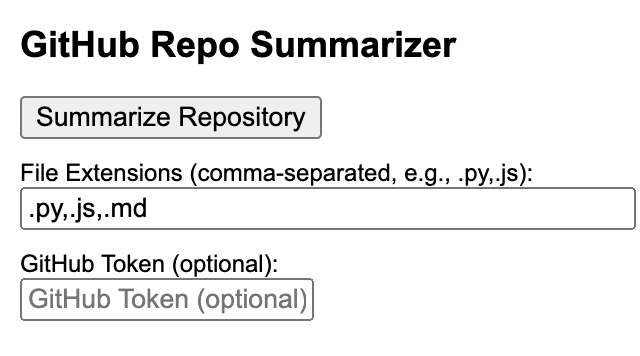

# GitHub Repo Summarizer Chrome Extension

## Overview

**GitHub Repo Summarizer** is a Chrome extension that allows you to quickly generate summaries of GitHub repositories directly from your browser. When viewing a repository on GitHub, the extension fetches the repository's file structure and content using the GitHub API, summarizes the code files by extracting key information, and displays the summary in an easy-to-read format.

## Features

- **Automatic Detection**: Detects when you're viewing a GitHub repository page.
- **Code Summarization**: Extracts comments and function definitions from code files.
- **Customizable File Types**: Supports a wide range of programming languages.
- **GitHub API Integration**: Fetches repository data using the GitHub API.
- **Personal Access Token Support**: Optionally use your GitHub token to increase API rate limits.
- **Autoscrolling**: Automatically scrolls the popup window to display the summary immediately after generation.
- **User Feedback Collection**: Provides a feedback form for users to suggest new features or report issues.

## Installation

1. **Clone or Download the Extension**:

   ```bash
   git clone https://github.com/zack-dev-cm/github-repo-sum-chrome-plugin
   ```

2. **Open Chrome Extensions Page**:

   - Navigate to `chrome://extensions/` in your Chrome browser.

3. **Enable Developer Mode**:

   - Toggle the **Developer mode** switch in the top right corner.

4. **Load Unpacked Extension**:

   - Click on **Load unpacked** and select the directory where you cloned or downloaded the extension.

5. **Verify Installation**:

   - The **GitHub Repo Summarizer** extension should now appear in your list of extensions.

## Usage

1. **Navigate to a GitHub Repository**:

   - Go to any GitHub repository page, e.g., [https://github.com/torvalds/linux](https://github.com/torvalds/linux).

2. **Open the Extension Popup**:

   - Click on the **GitHub Repo Summarizer** icon in the Chrome toolbar.

3. **Summarize the Repository**:

   - In the popup window, you can pick a commit from the dropdown or specify a branch name.
   - Click the **Summarize Repository** button to generate the summary.
   - Optionally, enter your GitHub Personal Access Token for higher rate limits.

4. **View the Summary**:

   - Wait for the extension to fetch and process the repository data.
   - The summary will be displayed in the popup window.
   - The popup will automatically scroll to the summary section for immediate visibility.

5. **Provide Feedback**:

   - Scroll down to the **Feedback Section** at the bottom of the popup.
   - Enter your feedback, suggestions, or report any issues in the provided textarea.
   - Click the **Submit Feedback** button to send your feedback via email.

## Screenshots


*The extension's popup window where you can initiate summarization and provide feedback.*

<!-- 

*An example of the generated summary displayed in the extension.*
-->

## Configuration

- **Supported File Types**:

  The extension supports summarizing files with the following extensions:

  ```
  .js, .ts, .py, .java, .cpp, .c, .cs, .php, .rb,
  .go, .rs, .kt, .swift, .m, .h, .css, .html, .json,
  .xml, .sh, .bat, .ps1, .pl, .lua, .dart
  ```

- **Customizing Supported File Types**:

  To add or remove file types, use the **Advanced Settings** in the extension popup:

  1. Click on the **Advanced Settings** button in the popup.
  2. Click the **Pre-scan Repository** button to fetch available file extensions.
  3. Select or deselect the file extensions you want to include in the summary.
  4. Alternatively, directly edit the **File Extensions to Include** text field by adding or removing extensions separated by commas.

## Limitations

- **GitHub API Rate Limits**:
  
  - Unauthenticated requests are limited to 60 requests per hour.
  - Using a GitHub Personal Access Token increases the limit to 5,000 requests per hour.
  - [How to create a GitHub Personal Access Token](https://docs.github.com/en/authentication/keeping-your-account-and-data-secure/creating-a-personal-access-token).

- **Large Repositories**:
  
  - The extension may have difficulty processing very large repositories.
  - Files larger than 100 KB are skipped to improve performance.

- **Autoscroll Behavior**:
  
  - The autoscroll feature relies on the popup's scroll behavior and may vary based on the number of files and summary length.

## Troubleshooting

- **Not on a GitHub Repository Page**:
  
  - Ensure you are on a valid repository page (e.g., `https://github.com/user/repo`).

- **API Rate Limit Exceeded**:
  
  - Use a GitHub Personal Access Token to increase your rate limit.

- **Extension Not Working**:
  
  - Check if the extension is enabled in `chrome://extensions/`.
  - Make sure you're using the latest version of Chrome.

- **Feedback Submission Issues**:
  
  - Ensure your default email client is configured correctly for the feedback submission to work via `mailto`.

## Development

### Project Structure

- `manifest.json`: Extension configuration and permissions.
- `popup.html`: The extension's popup UI.
- `popup.js`: Logic for fetching and summarizing repository data.
- `styles.css`: Styling for the popup UI.
- `icons/`: Directory containing extension icons.
- `screenshots/`: Directory containing screenshots for the README.
- `spinner.gif`: Loading spinner image.

### Building from Source

1. **Clone the Repository**:

   ```bash
   git clone https://github.com/yourusername/github-repo-summarizer.git
   ```

2. **Modify the Code**:

   - Make your desired changes to the extension's source code.

3. **Reload the Extension**:

   - After making changes, go to `chrome://extensions/`, find the extension, and click **Reload**.

### Running Tests

End-to-end tests rely on [Puppeteer](https://pptr.dev/). Install dependencies and run the test suite with:

```bash
npm install
npm test
```

### Contributing

Contributions are welcome! Please follow these steps:

1. **Fork the Repository**:

   - Click the **Fork** button on GitHub.

2. **Create a Feature Branch**:

   ```bash
   git checkout -b feature/your-feature-name
   ```

3. **Commit Your Changes**:

   ```bash
   git commit -m "Add your feature"
   ```

4. **Push to Your Fork**:

   ```bash
   git push origin feature/your-feature-name
   ```

5. **Open a Pull Request**:

   - Go to the original repository and click **New Pull Request**.


## Acknowledgments

- **GitHub API**: For providing access to repository data.
- **Chrome Extension Documentation**: For guidance on building extensions.

## Feedback

Your feedback is invaluable to us! If you have any suggestions, feature requests, or encounter any issues, please use the **Feedback Section** within the extension popup to share your thoughts. We strive to make the **GitHub Repo Summarizer** better with each update.

---
